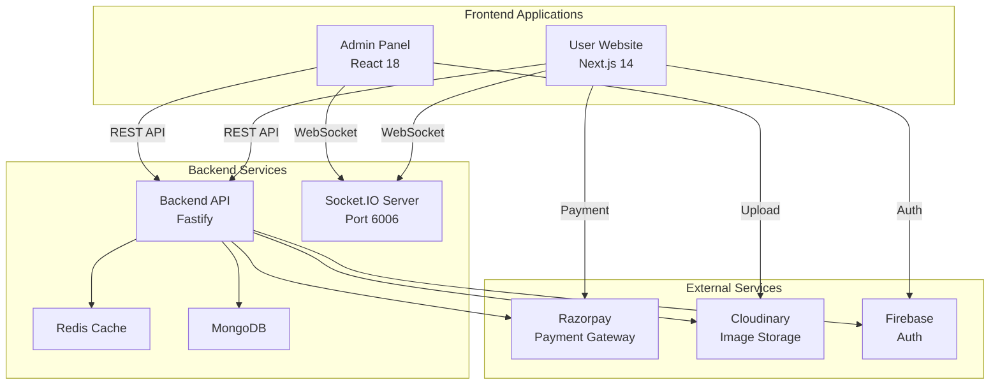

# Design Document

## Overview

This design document outlines the architecture and implementation details for two enterprise-level frontend applications that integrate with the existing GK Store multi-tenant SaaS e-commerce backend:

1. **User Website** - A Next.js 14 application using the App Router for customer-facing e-commerce functionality
2. **Admin Panel** - A React 18 + Vite application for comprehensive store management

Both applications will be built with TypeScript, Tailwind CSS, and modern React patterns. They will communicate with the backend-hub-b1 API (http://localhost:6005) and leverage Socket.IO for real-time updates.

### Technology Stack

**User Website (Next.js)**
- Framework: Next.js 14 with App Router
- Language: TypeScript 5.x
- Styling: Tailwind CSS
- State Management: Zustand (client state) + TanStack Query (server state)
- Forms: React Hook Form + Zod validation
- HTTP Client: Axios
- Real-time: Socket.IO Client
- UI Components: Lucide Icons, Framer Motion
- Payment: Razorpay SDK

**Admin Panel (React + Vite)**
- Framework: React 18 + Vite
- Language: TypeScript 5.x
- Routing: React Router v6
- Styling: Tailwind CSS
- State Management: Zustand (client state) + TanStack Query (server state)
- Forms: React Hook Form + Zod validation
- HTTP Client: Axios
- Real-time: Socket.IO Client
- Data Tables: TanStack Table
- Charts: Recharts
- UI Components: Lucide Icons

## Architecture

### High-Level Architecture



### Application Structure

**User Website Directory Structure**
```
user-website/
├── src/
│   ├── app/                    # Next.js App Router pages
│   │   ├── (auth)/            # Auth group routes
│   │   │   ├── login/
│   │   │   └── register/
│   │   ├── (shop)/            # Shop group routes
│   │   │   ├── products/
│   │   │   ├── cart/
│   │   │   ├── checkout/
│   │   │   └── orders/
│   │   ├── profile/
│   │   ├── layout.tsx
│   │   └── page.tsx
│   ├── components/            # React components
│   │   ├── ui/               # Reusable UI components
│   │   ├── layout/           # Layout components
│   │   ├── product/          # Product-related components
│   │   ├── cart/             # Cart components
│   │   └── checkout/         # Checkout components
│   ├── lib/                  # Utilities and configurations
│   │   ├── api/              # API client and endpoints
│   │   ├── socket/           # Socket.IO client
│   │   ├── utils/            # Helper functions
│   │   └── constants.ts
│   ├── store/                # Zustand stores
│   │   ├── auth.store.ts
│   │   ├── cart.store.ts
│   │   └── tenant.store.ts
│   ├── hooks/                # Custom React hooks
│   │   ├── useAuth.ts
│   │   ├── useCart.ts
│   │   └── useSocket.ts
│   └── types/                # TypeScript types
│       ├── api.types.ts
│       ├── product.types.ts
│       └── order.types.ts
├── public/
├── .env.local
├── next.config.js
├── tailwind.config.ts
└── package.json
```

**Admin Panel Directory Structure**
```
admin-panel/
├── src/
│   ├── pages/                # Page components
│   │   ├── Dashboard.tsx
│   │   ├── Products.tsx
│   │   ├── Orders.tsx
│   │   ├── Customers.tsx
│   │   ├── Categories.tsx
│   │   ├── Settings.tsx
│   │   ├── Subscription.tsx
│   │   └── Login.tsx
│   ├── components/           # React components
│   │   ├── layout/          # Layout components
│   │   │   ├── Sidebar.tsx
│   │   │   ├── Header.tsx
│   │   │   └── Layout.tsx
│   │   ├── dashboard/       # Dashboard widgets
│   │   ├── products/        # Product management
│   │   ├── orders/          # Order management
│   │   └── ui/              # Reusable UI components
│   ├── lib/                 # Utilities and configurations
│   │   ├── api/             # API client and endpoints
│   │   ├── socket/          # Socket.IO client
│   │   ├── utils/           # Helper functions
│   │   └── constants.ts
│   ├── store/               # Zustand stores
│   │   ├── auth.store.ts
│   │   ├── tenant.store.ts
│   │   └── ui.store.ts
│   ├── hooks/               # Custom React hooks
│   │   ├── useAuth.ts
│   │   ├── useSocket.ts
│   │   └── useTable.ts
│   ├── types/               # TypeScript types
│   │   ├── api.types.ts
│   │   ├── dashboard.types.ts
│   │   └── table.types.ts
│   ├── App.tsx
│   └── main.tsx
├── public/
├── .env
├── vite.config.ts
├── tailwind.config.ts
└── package.json
```

## Components and Interfaces

### API Client Architecture

Both applications will use a shared API client pattern with Axios:

```typescript
// lib/api/client.ts
import axios, { AxiosInstance, AxiosRequestConfig } from 'axios';

class APIClient {
  private client: AxiosInstance;
  
  constructor(baseURL: string) {
    this.client = axios.create({
      baseURL,
      timeout: 30000,
      headers: {
        'Content-Type': 'application/json',
      },
    });
    
    // Request interceptor for auth token
    this.client.interceptors.request.use(
      (config) => {
        const token = this.getAuthToken();
        if (token) {
          config.headers.Authorization = `Bearer ${token}`;
        }
        
        // Add tenant identifier
        const tenantId = this.getTenantId();
        if (tenantId) {
          config.headers['X-Project-ID'] = tenantId;
        }
        
        return config;
      },
      (error) => Promise.reject(error)
    );
    
    // Response interceptor for error handling
    this.client.interceptors.response.use(
      (response) => response,
      (error) => {
        if (error.response?.status === 401) {
          this.handleUnauthorized();
        }
        return Promise.reject(error);
      }
    );
  }
  
  private getAuthToken(): string | null {
    return localStorage.getItem('auth_token');
  }
  
  private getTenantId(): string | null {
    return localStorage.getItem('tenant_id');
  }
  
  private handleUnauthorized(): void {
    localStorage.removeItem('auth_token');
    window.location.href = '/login';
  }
  
  async get<T>(url: string, config?: AxiosRequestConfig): Promise<T> {
    const response = await this.client.get<T>(url, config);
    return response.data;
  }
  
  async post<T>(url: string, data?: any, config?: AxiosRequestConfig): Promise<T> {
    const response = await this.client.post<T>(url, data, config);
    return response.data;
  }
  
  async put<T>(url: string, data?: any, config?: AxiosRequestConfig): Promise<T> {
    const response = await this.client.put<T>(url, data, config);
    return response.data;
  }
  
  async delete<T>(url: string, config?: AxiosRequestConfig): Promise<T> {
    const response = await this.client.delete<T>(url, config);
    return response.data;
  }
}

export const apiClient = new APIClient(process.env.NEXT_PUBLIC_API_URL || 'http://localhost:6005');
```

### Socket.IO Client

```typescript
// lib/socket/client.ts
import { io, Socket } from 'socket.io-client';

class SocketClient {
  private socket: Socket | null = null;
  
  connect(token: string): void {
    if (this.socket?.connected) return;
    
    this.socket = io(process.env.NEXT_PUBLIC_SOCKET_URL || 'http://localhost:6006', {
      auth: { token },
      reconnection: true,
      reconnectionDelay: 1000,
      reconnectionAttempts: 5,
    });
    
    this.socket.on('connect', () => {
      console.log('Socket connected');
    });
    
    this.socket.on('disconnect', () => {
      console.log('Socket disconnected');
    });
    
    this.socket.on('connect_error', (error) => {
      console.error('Socket connection error:', error);
    });
  }
  
  disconnect(): void {
    if (this.socket) {
      this.socket.disconnect();
      this.socket = null;
    }
  }
  
  on(event: string, callback: (...args: any[]) => void): void {
    this.socket?.on(event, callback);
  }
  
  off(event: string, callback?: (...args: any[]) => void): void {
    this.socket?.off(event, callback);
  }
  
  emit(event: string, ...args: any[]): void {
    this.socket?.emit(event, ...args);
  }
}

export const socketClient = new SocketClient();
```

### State Management with Zustand

**Auth Store**
```typescript
// store/auth.store.ts
import { create } from 'zustand';
import { persist } from 'zustand/middleware';

interface User {
  id: string;
  email: string;
  name: string;
  role: string;
}

interface AuthState {
  user: User | null;
  token: string | null;
  isAuthenticated: boolean;
  login: (user: User, token: string) => void;
  logout: () => void;
  updateUser: (user: Partial<User>) => void;
}

export const useAuthStore = create<AuthState>()(
  persist(
    (set) => ({
      user: null,
      token: null,
      isAuthenticated: false,
      
      login: (user, token) => {
        localStorage.setItem('auth_token', token);
        set({ user, token, isAuthenticated: true });
      },
      
      logout: () => {
        localStorage.removeItem('auth_token');
        set({ user: null, token: null, isAuthenticated: false });
      },
      
      updateUser: (userData) => {
        set((state) => ({
          user: state.user ? { ...state.user, ...userData } : null,
        }));
      },
    }),
    {
      name: 'auth-storage',
    }
  )
);
```

**Cart Store (User Website)**
```typescript
// store/cart.store.ts
import { create } from 'zustand';
import { persist } from 'zustand/middleware';

interface CartItem {
  productId: string;
  name: string;
  price: number;
  quantity: number;
  image: string;
}

interface CartState {
  items: CartItem[];
  total: number;
  addItem: (item: CartItem) => void;
  removeItem: (productId: string) => void;
  updateQuantity: (productId: string, quantity: number) => void;
  clearCart: () => void;
  syncWithBackend: (items: CartItem[]) => void;
}

export const useCartStore = create<CartState>()(
  persist(
    (set) => ({
      items: [],
      total: 0,
      
      addItem: (item) => {
        set((state) => {
          const existingItem = state.items.find((i) => i.productId === item.productId);
          
          if (existingItem) {
            const updatedItems = state.items.map((i) =>
              i.productId === item.productId
                ? { ...i, quantity: i.quantity + item.quantity }
                : i
            );
            return {
              items: updatedItems,
              total: updatedItems.reduce((sum, i) => sum + i.price * i.quantity, 0),
            };
          }
          
          const newItems = [...state.items, item];
          return {
            items: newItems,
            total: newItems.reduce((sum, i) => sum + i.price * i.quantity, 0),
          };
        });
      },
      
      removeItem: (productId) => {
        set((state) => {
          const newItems = state.items.filter((i) => i.productId !== productId);
          return {
            items: newItems,
            total: newItems.reduce((sum, i) => sum + i.price * i.quantity, 0),
          };
        });
      },
      
      updateQuantity: (productId, quantity) => {
        set((state) => {
          const newItems = state.items.map((i) =>
            i.productId === productId ? { ...i, quantity } : i
          );
          return {
            items: newItems,
            total: newItems.reduce((sum, i) => sum + i.price * i.quantity, 0),
          };
        });
      },
      
      clearCart: () => {
        set({ items: [], total: 0 });
      },
      
      syncWithBackend: (items) => {
        set({
          items,
          total: items.reduce((sum, i) => sum + i.price * i.quantity, 0),
        });
      },
    }),
    {
      name: 'cart-storage',
    }
  )
);
```

### TanStack Query Integration

```typescript
// hooks/useProducts.ts
import { useQuery, useMutation, useQueryClient } from '@tanstack/react-query';
import { apiClient } from '@/lib/api/client';

interface Product {
  id: string;
  name: string;
  description: string;
  price: number;
  images: string[];
  category: string;
  stock: number;
}

interface ProductFilters {
  category?: string;
  minPrice?: number;
  maxPrice?: number;
  search?: string;
  page?: number;
  limit?: number;
}

export function useProducts(filters: ProductFilters = {}) {
  return useQuery({
    queryKey: ['products', filters],
    queryFn: () => apiClient.get<{ products: Product[]; total: number }>('/v1/api/products', {
      params: filters,
    }),
    staleTime: 5 * 60 * 1000, // 5 minutes
  });
}

export function useProduct(id: string) {
  return useQuery({
    queryKey: ['product', id],
    queryFn: () => apiClient.get<Product>(`/v1/api/products/${id}`),
    enabled: !!id,
  });
}

export function useCreateProduct() {
  const queryClient = useQueryClient();
  
  return useMutation({
    mutationFn: (data: Partial<Product>) => apiClient.post<Product>('/v1/api/products', data),
    onSuccess: () => {
      queryClient.invalidateQueries({ queryKey: ['products'] });
    },
  });
}

export function useUpdateProduct() {
  const queryClient = useQueryClient();
  
  return useMutation({
    mutationFn: ({ id, data }: { id: string; data: Partial<Product> }) =>
      apiClient.put<Product>(`/v1/api/products/${id}`, data),
    onSuccess: (_, variables) => {
      queryClient.invalidateQueries({ queryKey: ['products'] });
      queryClient.invalidateQueries({ queryKey: ['product', variables.id] });
    },
  });
}

export function useDeleteProduct() {
  const queryClient = useQueryClient();
  
  return useMutation({
    mutationFn: (id: string) => apiClient.delete(`/v1/api/products/${id}`),
    onSuccess: () => {
      queryClient.invalidateQueries({ queryKey: ['products'] });
    },
  });
}
```

## Data Models

### TypeScript Interfaces

**User Website Types**
```typescript
// types/api.types.ts

export interface User {
  id: string;
  email: string;
  name: string;
  phone?: string;
  role: 'customer' | 'admin';
  addresses: Address[];
  createdAt: string;
}

export interface Address {
  id: string;
  name: string;
  phone: string;
  addressLine1: string;
  addressLine2?: string;
  city: string;
  state: string;
  pincode: string;
  isDefault: boolean;
}

export interface Product {
  id: string;
  name: string;
  slug: string;
  description: string;
  price: number;
  comparePrice?: number;
  images: string[];
  category: Category;
  stock: number;
  sku: string;
  featured: boolean;
  rating: number;
  reviewCount: number;
  createdAt: string;
}

export interface Category {
  id: string;
  name: string;
  slug: string;
  description?: string;
  image?: string;
  parent?: string;
  children?: Category[];
}

export interface CartItem {
  id: string;
  productId: string;
  product: Product;
  quantity: number;
  price: number;
}

export interface Cart {
  id: string;
  userId: string;
  items: CartItem[];
  total: number;
  updatedAt: string;
}

export interface Order {
  id: string;
  orderNumber: string;
  userId: string;
  items: OrderItem[];
  subtotal: number;
  shipping: number;
  tax: number;
  total: number;
  status: OrderStatus;
  paymentMethod: 'razorpay' | 'cod';
  paymentStatus: PaymentStatus;
  shippingAddress: Address;
  trackingNumber?: string;
  deliveryProvider?: string;
  createdAt: string;
  updatedAt: string;
}

export interface OrderItem {
  productId: string;
  product: Product;
  quantity: number;
  price: number;
  total: number;
}

export type OrderStatus = 
  | 'pending'
  | 'confirmed'
  | 'processing'
  | 'shipped'
  | 'delivered'
  | 'cancelled';

export type PaymentStatus = 
  | 'pending'
  | 'completed'
  | 'failed'
  | 'refunded';

export interface Payment {
  id: string;
  orderId: string;
  amount: number;
  currency: string;
  method: 'razorpay' | 'cod';
  status: PaymentStatus;
  razorpayOrderId?: string;
  razorpayPaymentId?: string;
  createdAt: string;
}
```

**Admin Panel Types**
```typescript
// types/dashboard.types.ts

export interface DashboardMetrics {
  totalRevenue: number;
  totalOrders: number;
  totalProducts: number;
  totalCustomers: number;
  revenueChange: number;
  ordersChange: number;
  productsChange: number;
  customersChange: number;
}

export interface RevenueData {
  date: string;
  revenue: number;
  orders: number;
}

export interface TopProduct {
  id: string;
  name: string;
  sales: number;
  revenue: number;
  image: string;
}

export interface RecentOrder {
  id: string;
  orderNumber: string;
  customer: string;
  total: number;
  status: OrderStatus;
  createdAt: string;
}

export interface Subscription {
  id: string;
  tenantId: string;
  plan: SubscriptionPlan;
  status: SubscriptionStatus;
  currentPeriodStart: string;
  currentPeriodEnd: string;
  usage: UsageMetrics;
}

export type SubscriptionPlan = 'FREE' | 'STARTER' | 'PROFESSIONAL' | 'ENTERPRISE';

export type SubscriptionStatus = 'active' | 'cancelled' | 'expired' | 'trial';

export interface UsageMetrics {
  products: { used: number; limit: number };
  orders: { used: number; limit: number };
  storage: { used: number; limit: number };
  apiCalls: { used: number; limit: number };
}

export interface Tenant {
  id: string;
  businessName: string;
  email: string;
  logo?: string;
  primaryColor?: string;
  secondaryColor?: string;
  domain?: string;
  subdomain: string;
  subscription: Subscription;
  createdAt: string;
}

export interface APIKey {
  id: string;
  name: string;
  key: string;
  permissions: APIKeyPermission[];
  scopes: string[];
  expiresAt?: string;
  lastUsedAt?: string;
  createdAt: string;
}

export type APIKeyPermission = 'READ' | 'WRITE' | 'DELETE';
```

## Data Models (continued)

### Form Validation Schemas with Zod

**User Website Schemas**
```typescript
// lib/validation/schemas.ts
import { z } from 'zod';

export const loginSchema = z.object({
  email: z.string().email('Invalid email address'),
  password: z.string().min(6, 'Password must be at least 6 characters'),
});

export const registerSchema = z.object({
  name: z.string().min(2, 'Name must be at least 2 characters'),
  email: z.string().email('Invalid email address'),
  password: z.string().min(6, 'Password must be at least 6 characters'),
  confirmPassword: z.string(),
}).refine((data) => data.password === data.confirmPassword, {
  message: "Passwords don't match",
  path: ['confirmPassword'],
});

export const addressSchema = z.object({
  name: z.string().min(2, 'Name is required'),
  phone: z.string().regex(/^[0-9]{10}$/, 'Invalid phone number'),
  addressLine1: z.string().min(5, 'Address is required'),
  addressLine2: z.string().optional(),
  city: z.string().min(2, 'City is required'),
  state: z.string().min(2, 'State is required'),
  pincode: z.string().regex(/^[0-9]{6}$/, 'Invalid pincode'),
  isDefault: z.boolean().optional(),
});

export const checkoutSchema = z.object({
  addressId: z.string().min(1, 'Please select a delivery address'),
  paymentMethod: z.enum(['razorpay', 'cod']),
});
```

**Admin Panel Schemas**
```typescript
// lib/validation/schemas.ts
import { z } from 'zod';

export const productSchema = z.object({
  name: z.string().min(2, 'Product name is required'),
  description: z.string().min(10, 'Description must be at least 10 characters'),
  price: z.number().positive('Price must be positive'),
  comparePrice: z.number().positive().optional(),
  categoryId: z.string().min(1, 'Category is required'),
  stock: z.number().int().nonnegative('Stock cannot be negative'),
  sku: z.string().min(1, 'SKU is required'),
  images: z.array(z.string().url()).min(1, 'At least one image is required'),
  featured: z.boolean().optional(),
});

export const categorySchema = z.object({
  name: z.string().min(2, 'Category name is required'),
  description: z.string().optional(),
  parentId: z.string().optional(),
  image: z.string().url().optional(),
});

export const tenantSettingsSchema = z.object({
  businessName: z.string().min(2, 'Business name is required'),
  email: z.string().email('Invalid email address'),
  logo: z.string().url().optional(),
  primaryColor: z.string().regex(/^#[0-9A-F]{6}$/i, 'Invalid color format').optional(),
  secondaryColor: z.string().regex(/^#[0-9A-F]{6}$/i, 'Invalid color format').optional(),
});

export const apiKeySchema = z.object({
  name: z.string().min(2, 'API key name is required'),
  permissions: z.array(z.enum(['READ', 'WRITE', 'DELETE'])).min(1, 'Select at least one permission'),
  scopes: z.array(z.string()).optional(),
  expiresAt: z.string().datetime().optional(),
});
```


## Correctness Properties

*A property is a characteristic or behavior that should hold true across all valid executions of a system—essentially, a formal statement about what the system should do. Properties serve as the bridge between human-readable specifications and machine-verifiable correctness guarantees.*

### Property 1: Product Filter Consistency

*For any* combination of filters (category, price range, rating), all returned products should match ALL applied filter criteria.

**Validates: Requirements 1.3**

### Property 2: Product Search Relevance

*For any* search query, all returned products should contain the search term in either their name or description.

**Validates: Requirements 1.4**

### Property 3: Cart Count Accuracy

*For any* product added to cart, the cart count should increase by the quantity added.

**Validates: Requirements 2.1**

### Property 4: Cart Total Calculation

*For any* cart with items, the total should equal the sum of (price × quantity) for all items.

**Validates: Requirements 2.3**

### Property 5: Cart Item Removal

*For any* cart item removed, the item should no longer appear in the cart and the total should be recalculated.

**Validates: Requirements 2.4**

### Property 6: Authenticated Cart Persistence

*For any* authenticated user's cart changes, the cart data should sync to the backend API.

**Validates: Requirements 2.6**

### Property 7: Unauthenticated Cart Storage

*For any* unauthenticated user's cart changes, the cart data should persist in localStorage.

**Validates: Requirements 2.7**

### Property 8: Address Validation

*For any* address submission with invalid fields (missing required fields, invalid phone/pincode format), validation should fail with field-specific errors.

**Validates: Requirements 3.2**

### Property 9: Order Creation on Payment

*For any* successful payment completion, an order should be created in the backend with correct order details.

**Validates: Requirements 3.4**

### Property 10: Real-time Order Updates

*For any* order status change event received via Socket.IO, the UI should update to reflect the new status immediately.

**Validates: Requirements 4.3**

### Property 11: Order Cancellation

*For any* cancellable order, cancellation should update the order status to 'cancelled' in both UI and backend.

**Validates: Requirements 4.5**

### Property 12: Registration Validation

*For any* registration attempt with invalid credentials (invalid email format, password < 6 characters), validation should fail with appropriate error messages.

**Validates: Requirements 5.1**

### Property 13: Login Token Storage

*For any* successful login, a JWT token should be stored in localStorage and included in subsequent API requests.

**Validates: Requirements 5.2**

### Property 14: Logout Token Clearance

*For any* authenticated user logout, all authentication tokens should be removed from storage.

**Validates: Requirements 5.5**

### Property 15: Protected Route Access

*For any* protected route accessed without authentication, the application should redirect to the login page.

**Validates: Requirements 5.7, 17.3**

### Property 16: Profile Update Persistence

*For any* valid profile update, the changes should be saved to the backend and reflected in the UI.

**Validates: Requirements 6.2**

### Property 17: Address CRUD Operations

*For any* valid address operation (create, update, delete), the address list should update correctly in both UI and backend.

**Validates: Requirements 6.3, 6.4, 6.5**

### Property 18: Dashboard Real-time Metrics

*For any* metric change event received via Socket.IO, the dashboard should update the affected metric immediately.

**Validates: Requirements 8.6**

### Property 19: Product Validation

*For any* product creation or update with invalid data (missing required fields, negative price/stock), validation should fail with field-specific errors.

**Validates: Requirements 9.2, 9.4**

### Property 20: Product Deletion

*For any* product deletion, the product should be removed from the backend and no longer appear in the products list.

**Validates: Requirements 9.5**

### Property 21: Order Status Update Notification

*For any* order status update by admin, the change should be saved to backend and trigger a customer notification.

**Validates: Requirements 10.3**

### Property 22: Real-time Order Notifications

*For any* new order placed, the admin panel should receive a real-time notification via Socket.IO.

**Validates: Requirements 10.4**

### Property 23: Customer Search Accuracy

*For any* customer search query, all returned customers should match the search term in name, email, or phone.

**Validates: Requirements 11.2**

### Property 24: Category Validation

*For any* category creation or update with invalid data (missing name), validation should fail with appropriate errors.

**Validates: Requirements 12.2, 12.3**

### Property 25: Category Deletion Validation

*For any* category with associated products, deletion should be prevented with an appropriate error message.

**Validates: Requirements 12.4**

### Property 26: Settings Update Persistence

*For any* valid settings update (business name, brand colors), the changes should be saved to backend and applied to the UI theme.

**Validates: Requirements 14.2, 14.4**

### Property 27: API Key Permission Updates

*For any* valid API key permission update, the changes should be saved to the backend.

**Validates: Requirements 15.3**

### Property 28: Admin Authentication

*For any* valid admin credentials, authentication should succeed and store the JWT token.

**Validates: Requirements 17.1**

### Property 29: Admin Logout

*For any* authenticated admin logout, all authentication tokens should be cleared from storage.

**Validates: Requirements 17.4**

### Property 30: Socket.IO Authentication

*For any* Socket.IO connection attempt with a valid JWT token, the connection should authenticate successfully.

**Validates: Requirements 18.1**

### Property 31: Socket.IO Event Handling

*For any* Socket.IO event received (order updates, notifications), the UI should update immediately to reflect the change.

**Validates: Requirements 18.2, 18.5**

### Property 32: API Error Display

*For any* API request failure, a user-friendly error message should be displayed to the user.

**Validates: Requirements 19.1**

### Property 33: Validation Error Display

*For any* form validation failure, field-specific error messages should be displayed next to the invalid fields.

**Validates: Requirements 19.3**

### Property 34: API Response Caching

*For any* API response, subsequent identical requests within the cache time should use the cached response instead of making a new request.

**Validates: Requirements 20.5**

### Property 35: Auth State Management

*For any* authentication event (login, logout), the auth state in Zustand should update correctly.

**Validates: Requirements 21.1**

### Property 36: Cart State Management

*For any* cart operation (add, remove, update), the cart state in Zustand should update globally and trigger re-renders.

**Validates: Requirements 21.2**

### Property 37: State Persistence

*For any* critical state change (auth, cart), the state should persist to localStorage and restore on page reload.

**Validates: Requirements 21.5**

### Property 38: Multi-tenant Request Headers

*For any* API request, the tenant identifier should be included in the request headers (X-Project-ID).

**Validates: Requirements 22.1**

### Property 39: Tenant Branding Application

*For any* tenant with custom branding (colors, logo), the branding should be loaded and applied to the UI.

**Validates: Requirements 22.2, 22.4**

## Error Handling

### Error Handling Strategy

Both applications will implement a comprehensive error handling strategy:

**API Error Handling**
```typescript
// lib/api/errorHandler.ts
import { AxiosError } from 'axios';

export interface APIError {
  message: string;
  code?: string;
  field?: string;
  statusCode?: number;
}

export function handleAPIError(error: unknown): APIError {
  if (error instanceof AxiosError) {
    const statusCode = error.response?.status;
    const data = error.response?.data;
    
    // Handle specific status codes
    switch (statusCode) {
      case 400:
        return {
          message: data?.message || 'Invalid request',
          code: data?.code,
          field: data?.field,
          statusCode,
        };
      
      case 401:
        return {
          message: 'Authentication required',
          code: 'UNAUTHORIZED',
          statusCode,
        };
      
      case 403:
        return {
          message: data?.message || 'Access denied',
          code: 'FORBIDDEN',
          statusCode,
        };
      
      case 404:
        return {
          message: data?.message || 'Resource not found',
          code: 'NOT_FOUND',
          statusCode,
        };
      
      case 429:
        return {
          message: 'Too many requests. Please try again later.',
          code: 'RATE_LIMIT',
          statusCode,
        };
      
      case 500:
      case 502:
      case 503:
        return {
          message: 'Server error. Please try again later.',
          code: 'SERVER_ERROR',
          statusCode,
        };
      
      default:
        return {
          message: data?.message || 'An error occurred',
          code: data?.code,
          statusCode,
        };
    }
  }
  
  // Network errors
  if (error instanceof Error && error.message === 'Network Error') {
    return {
      message: 'Network error. Please check your connection.',
      code: 'NETWORK_ERROR',
    };
  }
  
  // Unknown errors
  return {
    message: 'An unexpected error occurred',
    code: 'UNKNOWN_ERROR',
  };
}
```

**Form Validation Error Handling**
```typescript
// components/ui/FormField.tsx
import { useFormContext } from 'react-hook-form';

interface FormFieldProps {
  name: string;
  label: string;
  type?: string;
  placeholder?: string;
}

export function FormField({ name, label, type = 'text', placeholder }: FormFieldProps) {
  const { register, formState: { errors } } = useFormContext();
  const error = errors[name];
  
  return (
    <div className="form-field">
      <label htmlFor={name} className="block text-sm font-medium text-gray-700">
        {label}
      </label>
      <input
        id={name}
        type={type}
        placeholder={placeholder}
        {...register(name)}
        className={`mt-1 block w-full rounded-md border ${
          error ? 'border-red-500' : 'border-gray-300'
        } px-3 py-2 focus:outline-none focus:ring-2 focus:ring-blue-500`}
      />
      {error && (
        <p className="mt-1 text-sm text-red-600">
          {error.message as string}
        </p>
      )}
    </div>
  );
}
```

**Global Error Boundary**
```typescript
// components/ErrorBoundary.tsx
import React, { Component, ReactNode } from 'react';

interface Props {
  children: ReactNode;
  fallback?: ReactNode;
}

interface State {
  hasError: boolean;
  error?: Error;
}

export class ErrorBoundary extends Component<Props, State> {
  constructor(props: Props) {
    super(props);
    this.state = { hasError: false };
  }
  
  static getDerivedStateFromError(error: Error): State {
    return { hasError: true, error };
  }
  
  componentDidCatch(error: Error, errorInfo: React.ErrorInfo) {
    console.error('Error caught by boundary:', error, errorInfo);
    // Log to error tracking service (e.g., Sentry)
  }
  
  render() {
    if (this.state.hasError) {
      return this.props.fallback || (
        <div className="flex items-center justify-center min-h-screen">
          <div className="text-center">
            <h1 className="text-2xl font-bold text-gray-900 mb-4">
              Something went wrong
            </h1>
            <p className="text-gray-600 mb-4">
              We're sorry for the inconvenience. Please try refreshing the page.
            </p>
            <button
              onClick={() => window.location.reload()}
              className="px-4 py-2 bg-blue-600 text-white rounded-md hover:bg-blue-700"
            >
              Refresh Page
            </button>
          </div>
        </div>
      );
    }
    
    return this.props.children;
  }
}
```

**Toast Notifications for Errors**
```typescript
// lib/toast.ts
import { toast as sonnerToast } from 'sonner';

export const toast = {
  success: (message: string) => {
    sonnerToast.success(message);
  },
  
  error: (message: string) => {
    sonnerToast.error(message);
  },
  
  info: (message: string) => {
    sonnerToast.info(message);
  },
  
  warning: (message: string) => {
    sonnerToast.warning(message);
  },
};

// Usage in components
import { toast } from '@/lib/toast';
import { handleAPIError } from '@/lib/api/errorHandler';

try {
  await apiClient.post('/v1/api/products', productData);
  toast.success('Product created successfully');
} catch (error) {
  const apiError = handleAPIError(error);
  toast.error(apiError.message);
}
```

### Error Handling Patterns

1. **API Errors**: Caught by Axios interceptors, transformed to user-friendly messages
2. **Validation Errors**: Displayed inline next to form fields using React Hook Form
3. **Network Errors**: Detected and displayed with retry options
4. **Authentication Errors**: Trigger automatic redirect to login page
5. **Permission Errors**: Display access denied message with upgrade prompt (for subscription limits)
6. **Runtime Errors**: Caught by Error Boundary, display fallback UI
7. **Socket.IO Errors**: Log and attempt reconnection automatically

## Testing Strategy

### Testing Approach

Both applications will use a dual testing approach combining unit tests and property-based tests:

**Unit Tests**
- Test specific UI components render correctly
- Test user interactions (clicks, form submissions)
- Test edge cases (empty states, error states)
- Test integration between components
- Use React Testing Library for component testing
- Use Vitest as the test runner

**Property-Based Tests**
- Test universal properties across many generated inputs
- Validate business logic with random data
- Test state management with various state transitions
- Use fast-check library for property-based testing
- Minimum 100 iterations per property test

### Testing Tools

**User Website (Next.js)**
- Test Runner: Vitest
- Component Testing: React Testing Library
- Property Testing: fast-check
- Mocking: MSW (Mock Service Worker) for API mocking
- E2E Testing: Playwright (optional)

**Admin Panel (React + Vite)**
- Test Runner: Vitest
- Component Testing: React Testing Library
- Property Testing: fast-check
- Mocking: MSW (Mock Service Worker) for API mocking
- E2E Testing: Playwright (optional)

### Test Structure

```typescript
// Example unit test
// components/ProductCard.test.tsx
import { render, screen } from '@testing-library/react';
import { ProductCard } from './ProductCard';

describe('ProductCard', () => {
  it('should display product information', () => {
    const product = {
      id: '1',
      name: 'Test Product',
      price: 999,
      image: 'https://example.com/image.jpg',
    };
    
    render(<ProductCard product={product} />);
    
    expect(screen.getByText('Test Product')).toBeInTheDocument();
    expect(screen.getByText('₹999')).toBeInTheDocument();
  });
  
  it('should display empty state when no image', () => {
    const product = {
      id: '1',
      name: 'Test Product',
      price: 999,
      image: '',
    };
    
    render(<ProductCard product={product} />);
    
    expect(screen.getByTestId('placeholder-image')).toBeInTheDocument();
  });
});
```

```typescript
// Example property test
// store/cart.store.test.ts
import { describe, it, expect } from 'vitest';
import * as fc from 'fast-check';
import { useCartStore } from './cart.store';

/**
 * Feature: frontend-applications, Property 4: Cart Total Calculation
 * For any cart with items, the total should equal the sum of (price × quantity) for all items.
 */
describe('Cart Store - Property Tests', () => {
  it('Property 4: cart total should equal sum of (price × quantity)', () => {
    fc.assert(
      fc.property(
        fc.array(
          fc.record({
            productId: fc.uuid(),
            name: fc.string(),
            price: fc.integer({ min: 1, max: 100000 }),
            quantity: fc.integer({ min: 1, max: 100 }),
            image: fc.webUrl(),
          }),
          { minLength: 1, maxLength: 20 }
        ),
        (items) => {
          const store = useCartStore.getState();
          store.clearCart();
          
          // Add all items to cart
          items.forEach((item) => store.addItem(item));
          
          // Calculate expected total
          const expectedTotal = items.reduce(
            (sum, item) => sum + item.price * item.quantity,
            0
          );
          
          // Verify cart total matches expected
          expect(store.total).toBe(expectedTotal);
        }
      ),
      { numRuns: 100 }
    );
  });
});
```

### Test Coverage Goals

- **Unit Test Coverage**: Minimum 70% code coverage
- **Property Test Coverage**: All correctness properties implemented as tests
- **Critical Paths**: 100% coverage for authentication, checkout, and payment flows
- **Component Coverage**: All reusable UI components tested
- **Integration Coverage**: Key user flows tested end-to-end

### Testing Best Practices

1. **Test Behavior, Not Implementation**: Focus on what the component does, not how it does it
2. **Use Semantic Queries**: Prefer getByRole, getByLabelText over getByTestId
3. **Mock External Dependencies**: Use MSW to mock API calls
4. **Test Accessibility**: Ensure components are accessible (ARIA labels, keyboard navigation)
5. **Property Test Generators**: Write smart generators that constrain to valid input space
6. **Avoid Over-Testing**: Don't test third-party libraries or framework behavior
7. **Test Real User Scenarios**: Write tests that mirror actual user interactions

### Continuous Integration

- Run tests on every pull request
- Fail builds if tests don't pass
- Generate coverage reports
- Run property tests with increased iterations in CI (500+)

## Implementation Notes

### Development Workflow

1. **Setup Phase**
   - Initialize Next.js and React projects
   - Install dependencies
   - Configure TypeScript, Tailwind CSS, ESLint
   - Set up environment variables
   - Configure API client and Socket.IO

2. **Core Infrastructure**
   - Implement API client with interceptors
   - Set up Zustand stores
   - Configure TanStack Query
   - Implement Socket.IO client
   - Create error handling utilities
   - Set up routing (Next.js App Router / React Router)

3. **Authentication**
   - Implement login/register pages
   - Create auth hooks and stores
   - Set up protected routes
   - Implement Firebase integration
   - Add phone OTP flow

4. **User Website Features**
   - Build product browsing pages
   - Implement shopping cart
   - Create checkout flow
   - Add Razorpay integration
   - Build order tracking
   - Implement user profile

5. **Admin Panel Features**
   - Build dashboard with analytics
   - Implement product management
   - Create order management
   - Add customer management
   - Build category management
   - Implement settings pages
   - Add subscription management

6. **Real-time Features**
   - Connect Socket.IO for order updates
   - Implement real-time notifications
   - Add live dashboard updates

7. **Testing**
   - Write unit tests for components
   - Implement property tests for business logic
   - Test critical user flows
   - Achieve coverage goals

8. **Optimization**
   - Implement code splitting
   - Add image optimization
   - Configure caching strategies
   - Optimize bundle size
   - Add performance monitoring

### Deployment Considerations

**User Website (Next.js)**
- Deploy to Vercel (recommended) or any Node.js hosting
- Configure environment variables
- Set up custom domain
- Enable ISR (Incremental Static Regeneration) for product pages
- Configure CDN for static assets

**Admin Panel (React + Vite)**
- Build static files: `npm run build`
- Deploy to Netlify, Vercel, or any static hosting
- Configure environment variables
- Set up custom domain
- Enable SPA routing fallback

**Environment Variables**
```env
# User Website (.env.local)
NEXT_PUBLIC_API_URL=https://api.yourdomain.com
NEXT_PUBLIC_SOCKET_URL=https://socket.yourdomain.com
NEXT_PUBLIC_RAZORPAY_KEY=rzp_live_xxxxx
NEXT_PUBLIC_FIREBASE_API_KEY=xxxxx
NEXT_PUBLIC_FIREBASE_AUTH_DOMAIN=xxxxx
NEXT_PUBLIC_FIREBASE_PROJECT_ID=xxxxx

# Admin Panel (.env)
VITE_API_URL=https://api.yourdomain.com
VITE_SOCKET_URL=https://socket.yourdomain.com
```

### Performance Targets

- **First Contentful Paint (FCP)**: < 1.5s
- **Largest Contentful Paint (LCP)**: < 2.5s
- **Time to Interactive (TTI)**: < 3.5s
- **Cumulative Layout Shift (CLS)**: < 0.1
- **First Input Delay (FID)**: < 100ms
- **Bundle Size**: < 200KB (gzipped) for initial load

### Accessibility Requirements

- WCAG 2.1 Level AA compliance
- Keyboard navigation support
- Screen reader compatibility
- Proper ARIA labels
- Color contrast ratios meet standards
- Focus indicators visible
- Form labels and error messages accessible

### Browser Support

- Chrome (last 2 versions)
- Firefox (last 2 versions)
- Safari (last 2 versions)
- Edge (last 2 versions)
- Mobile browsers (iOS Safari, Chrome Mobile)

### Security Considerations

- XSS protection (React's built-in escaping)
- CSRF protection (SameSite cookies)
- Secure token storage (httpOnly cookies preferred, localStorage as fallback)
- Input sanitization
- Rate limiting on client side
- Content Security Policy headers
- HTTPS only in production
